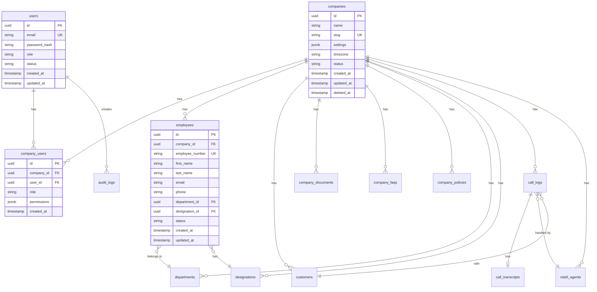

# PEOPLIX Database Schema

## Overview

PostgreSQL schema designed for multi-tenant SaaS with strict tenant isolation. Every tenant-owned table includes `company_id` with proper indexes and foreign key constraints.

## Schema Principles

1. **Tenant isolation**: Every company-owned entity has `company_id`
2. **Composite indexes**: `(company_id, ...)` for all tenant queries
3. **Foreign keys**: Enforce referential integrity
4. **Timestamps**: `created_at`, `updated_at` on all tables
5. **Soft deletes**: `deleted_at` where appropriate
6. **UUIDs**: For external IDs (prevents enumeration)

## Entity Relationship Diagram



## Core Tables

### 1. companies

Primary tenant table. Every company is a separate tenant.

```sql
CREATE TABLE companies (
    id UUID PRIMARY KEY DEFAULT gen_random_uuid(),
    name VARCHAR(255) NOT NULL,
    slug VARCHAR(100) UNIQUE NOT NULL,
    
    -- Contact information
    email VARCHAR(255),
    phone VARCHAR(50),
    website VARCHAR(255),
    
    -- Address
    address_line1 VARCHAR(255),
    address_line2 VARCHAR(255),
    city VARCHAR(100),
    state VARCHAR(100),
    country VARCHAR(100),
    postal_code VARCHAR(20),
    
    -- Configuration
    settings JSONB DEFAULT '{}'::jsonb,
    timezone VARCHAR(50) DEFAULT 'UTC',
    
    -- Status
    status VARCHAR(20) DEFAULT 'active' CHECK (status IN ('active', 'suspended', 'inactive')),
    subscription_tier VARCHAR(50) DEFAULT 'basic',
    
    -- Metadata
    created_at TIMESTAMP WITH TIME ZONE DEFAULT CURRENT_TIMESTAMP,
    updated_at TIMESTAMP WITH TIME ZONE DEFAULT CURRENT_TIMESTAMP,
    deleted_at TIMESTAMP WITH TIME ZONE
);

CREATE INDEX idx_companies_slug ON companies(slug);
CREATE INDEX idx_companies_status ON companies(status) WHERE deleted_at IS NULL;
```

### 2. users

Platform users (admins, super admins, company admins).

```sql
CREATE TABLE users (
    id UUID PRIMARY KEY DEFAULT gen_random_uuid(),
    email VARCHAR(255) UNIQUE NOT NULL,
    password_hash VARCHAR(255) NOT NULL,
    
    -- Profile
    first_name VARCHAR(100),
    last_name VARCHAR(100),
    phone VARCHAR(50),
    
    -- Role: 'super_admin', 'company_admin', 'company_user'
    role VARCHAR(50) NOT NULL DEFAULT 'company_user',
    
    -- Status
    status VARCHAR(20) DEFAULT 'active' CHECK (status IN ('active', 'inactive', 'suspended')),
    email_verified BOOLEAN DEFAULT FALSE,
    
    -- Security
    last_login_at TIMESTAMP WITH TIME ZONE,
    password_changed_at TIMESTAMP WITH TIME ZONE,
    failed_login_attempts INTEGER DEFAULT 0,
    locked_until TIMESTAMP WITH TIME ZONE,
    
    -- Metadata
    created_at TIMESTAMP WITH TIME ZONE DEFAULT CURRENT_TIMESTAMP,
    updated_at TIMESTAMP WITH TIME ZONE DEFAULT CURRENT_TIMESTAMP,
    deleted_at TIMESTAMP WITH TIME ZONE
);

CREATE INDEX idx_users_email ON users(email) WHERE deleted_at IS NULL;
CREATE INDEX idx_users_role ON users(role);
```

### 3. company_users

Maps users to companies (many-to-many). A user can belong to multiple companies.

```sql
CREATE TABLE company_users (
    id UUID PRIMARY KEY DEFAULT gen_random_uuid(),
    company_id UUID NOT NULL REFERENCES companies(id) ON DELETE CASCADE,
    user_id UUID NOT NULL REFERENCES users(id) ON DELETE CASCADE,
    
    -- Role within this company
    role VARCHAR(50) NOT NULL DEFAULT 'member',
    
    -- Permissions
    permissions JSONB DEFAULT '[]'::jsonb,
    
    -- Status
    status VARCHAR(20) DEFAULT 'active',
    
    -- Metadata
    invited_by UUID REFERENCES users(id),
    invited_at TIMESTAMP WITH TIME ZONE,
    joined_at TIMESTAMP WITH TIME ZONE DEFAULT CURRENT_TIMESTAMP,
    created_at TIMESTAMP WITH TIME ZONE DEFAULT CURRENT_TIMESTAMP,
    
    UNIQUE(company_id, user_id)
);

CREATE INDEX idx_company_users_company ON company_users(company_id);
CREATE INDEX idx_company_users_user ON company_users(user_id);
CREATE INDEX idx_company_users_lookup ON company_users(company_id, user_id);
```

### 4. departments

Company organizational units.

```sql
CREATE TABLE departments (
    id UUID PRIMARY KEY DEFAULT gen_random_uuid(),
    company_id UUID NOT NULL REFERENCES companies(id) ON DELETE CASCADE,
    
    -- Department info
    name VARCHAR(255) NOT NULL,
    code VARCHAR(50),
    description TEXT,
    
    -- Hierarchy
    parent_department_id UUID REFERENCES departments(id),
    
    -- Manager
    manager_id UUID REFERENCES employees(id),
    
    -- Status
    status VARCHAR(20) DEFAULT 'active',
    
    -- Metadata
    created_at TIMESTAMP WITH TIME ZONE DEFAULT CURRENT_TIMESTAMP,
    updated_at TIMESTAMP WITH TIME ZONE DEFAULT CURRENT_TIMESTAMP,
    
    UNIQUE(company_id, code)
);

CREATE INDEX idx_departments_company ON departments(company_id);
CREATE INDEX idx_departments_company_name ON departments(company_id, name);
```

### 5. designations

Job titles/positions.

```sql
CREATE TABLE designations (
    id UUID PRIMARY KEY DEFAULT gen_random_uuid(),
    company_id UUID NOT NULL REFERENCES companies(id) ON DELETE CASCADE,
    
    -- Designation info
    title VARCHAR(255) NOT NULL,
    code VARCHAR(50),
    description TEXT,
    level VARCHAR(50),
    
    -- Status
    status VARCHAR(20) DEFAULT 'active',
    
    -- Metadata
    created_at TIMESTAMP WITH TIME ZONE DEFAULT CURRENT_TIMESTAMP,
    updated_at TIMESTAMP WITH TIME ZONE DEFAULT CURRENT_TIMESTAMP,
    
    UNIQUE(company_id, code)
);

CREATE INDEX idx_designations_company ON designations(company_id);
CREATE INDEX idx_designations_company_title ON designations(company_id, title);
```

### 6. employees

Company employees (the primary data for AI queries).

```sql
CREATE TABLE employees (
    id UUID PRIMARY KEY DEFAULT gen_random_uuid(),
    company_id UUID NOT NULL REFERENCES companies(id) ON DELETE CASCADE,
    
    -- Identification
    employee_number VARCHAR(50) NOT NULL,
    
    -- Personal info
    first_name VARCHAR(100) NOT NULL,
    last_name VARCHAR(100) NOT NULL,
    email VARCHAR(255),
    phone VARCHAR(50),
    date_of_birth DATE,
    
    -- Employment
    department_id UUID REFERENCES departments(id),
    designation_id UUID REFERENCES designations(id),
    manager_id UUID REFERENCES employees(id),
    
    hire_date DATE,
    termination_date DATE,
    employment_type VARCHAR(50), -- 'full-time', 'part-time', 'contract', 'intern'
    
    -- Status
    status VARCHAR(20) DEFAULT 'active' CHECK (status IN ('active', 'inactive', 'terminated', 'on_leave')),
    
    -- Additional data
    metadata JSONB DEFAULT '{}'::jsonb,
    
    -- Metadata
    created_at TIMESTAMP WITH TIME ZONE DEFAULT CURRENT_TIMESTAMP,
    updated_at TIMESTAMP WITH TIME ZONE DEFAULT CURRENT_TIMESTAMP,
    
    UNIQUE(company_id, employee_number)
);

CREATE INDEX idx_employees_company ON employees(company_id) WHERE status = 'active';
CREATE INDEX idx_employees_company_number ON employees(company_id, employee_number);
CREATE INDEX idx_employees_company_name ON employees(company_id, first_name, last_name);
CREATE INDEX idx_employees_department ON employees(company_id, department_id);
CREATE INDEX idx_employees_designation ON employees(company_id, designation_id);
CREATE INDEX idx_employees_email ON employees(company_id, email);
```

### 7. customers

External customers/callers (optional, for call tracking).

```sql
CREATE TABLE customers (
    id UUID PRIMARY KEY DEFAULT gen_random_uuid(),
    company_id UUID NOT NULL REFERENCES companies(id) ON DELETE CASCADE,
    
    -- Customer info
    first_name VARCHAR(100),
    last_name VARCHAR(100),
    email VARCHAR(255),
    phone VARCHAR(50),
    
    -- Additional data
    metadata JSONB DEFAULT '{}'::jsonb,
    
    -- Status
    status VARCHAR(20) DEFAULT 'active',
    
    -- Metadata
    created_at TIMESTAMP WITH TIME ZONE DEFAULT CURRENT_TIMESTAMP,
    updated_at TIMESTAMP WITH TIME ZONE DEFAULT CURRENT_TIMESTAMP,
    
    UNIQUE(company_id, phone)
);

CREATE INDEX idx_customers_company ON customers(company_id);
CREATE INDEX idx_customers_phone ON customers(company_id, phone);
CREATE INDEX idx_customers_email ON customers(company_id, email);
```

### 8. company_documents

Uploaded company documents/knowledge base.

```sql
CREATE TABLE company_documents (
    id UUID PRIMARY KEY DEFAULT gen_random_uuid(),
    company_id UUID NOT NULL REFERENCES companies(id) ON DELETE CASCADE,
    
    -- Document info
    title VARCHAR(255) NOT NULL,
    type VARCHAR(50), -- 'policy', 'handbook', 'procedure', 'form', 'other'
    description TEXT,
    
    -- File info
    file_name VARCHAR(255),
    file_size BIGINT,
    file_type VARCHAR(100),
    storage_path VARCHAR(500),
    
    -- Content (for searchable text)
    content_text TEXT,
    
    -- Access control
    visibility VARCHAR(20) DEFAULT 'private', -- 'public', 'private', 'restricted'
    
    -- Status
    status VARCHAR(20) DEFAULT 'active',
    
    -- Metadata
    uploaded_by UUID REFERENCES users(id),
    created_at TIMESTAMP WITH TIME ZONE DEFAULT CURRENT_TIMESTAMP,
    updated_at TIMESTAMP WITH TIME ZONE DEFAULT CURRENT_TIMESTAMP
);

CREATE INDEX idx_documents_company ON company_documents(company_id);
CREATE INDEX idx_documents_company_type ON company_documents(company_id, type);
CREATE INDEX idx_documents_company_title ON company_documents(company_id, title);
```

### 9. company_faqs

Frequently asked questions.

```sql
CREATE TABLE company_faqs (
    id UUID PRIMARY KEY DEFAULT gen_random_uuid(),
    company_id UUID NOT NULL REFERENCES companies(id) ON DELETE CASCADE,
    
    -- FAQ content
    question TEXT NOT NULL,
    answer TEXT NOT NULL,
    category VARCHAR(100),
    
    -- Metadata
    keywords TEXT[],
    priority INTEGER DEFAULT 0,
    
    -- Status
    status VARCHAR(20) DEFAULT 'active',
    
    -- Metadata
    created_by UUID REFERENCES users(id),
    created_at TIMESTAMP WITH TIME ZONE DEFAULT CURRENT_TIMESTAMP,
    updated_at TIMESTAMP WITH TIME ZONE DEFAULT CURRENT_TIMESTAMP
);

CREATE INDEX idx_faqs_company ON company_faqs(company_id) WHERE status = 'active';
CREATE INDEX idx_faqs_company_category ON company_faqs(company_id, category);
```

### 10. company_policies

Company policies and procedures.

```sql
CREATE TABLE company_policies (
    id UUID PRIMARY KEY DEFAULT gen_random_uuid(),
    company_id UUID NOT NULL REFERENCES companies(id) ON DELETE CASCADE,
    
    -- Policy info
    title VARCHAR(255) NOT NULL,
    code VARCHAR(50),
    category VARCHAR(100),
    description TEXT,
    content TEXT NOT NULL,
    
    -- Versioning
    version VARCHAR(20) DEFAULT '1.0',
    effective_date DATE,
    review_date DATE,
    
    -- Status
    status VARCHAR(20) DEFAULT 'draft' CHECK (status IN ('draft', 'active', 'archived')),
    
    -- Metadata
    created_by UUID REFERENCES users(id),
    approved_by UUID REFERENCES users(id),
    created_at TIMESTAMP WITH TIME ZONE DEFAULT CURRENT_TIMESTAMP,
    updated_at TIMESTAMP WITH TIME ZONE DEFAULT CURRENT_TIMESTAMP,
    
    UNIQUE(company_id, code)
);

CREATE INDEX idx_policies_company ON company_policies(company_id) WHERE status = 'active';
CREATE INDEX idx_policies_company_category ON company_policies(company_id, category);
```

### 11. retell_agents

Retell AI agent configurations per company.

```sql
CREATE TABLE retell_agents (
    id UUID PRIMARY KEY DEFAULT gen_random_uuid(),
    company_id UUID NOT NULL REFERENCES companies(id) ON DELETE CASCADE,
    
    -- Retell identifiers
    retell_agent_id VARCHAR(255) NOT NULL,
    retell_llm_id VARCHAR(255),
    
    -- Agent info
    name VARCHAR(255) NOT NULL,
    description TEXT,
    
    -- Configuration
    config JSONB DEFAULT '{}'::jsonb,
    
    -- Status
    status VARCHAR(20) DEFAULT 'active',
    
    -- Metadata
    created_at TIMESTAMP WITH TIME ZONE DEFAULT CURRENT_TIMESTAMP,
    updated_at TIMESTAMP WITH TIME ZONE DEFAULT CURRENT_TIMESTAMP,
    
    UNIQUE(company_id, retell_agent_id)
);

CREATE INDEX idx_retell_agents_company ON retell_agents(company_id);
CREATE INDEX idx_retell_agents_retell_id ON retell_agents(retell_agent_id);
```

### 12. call_logs

Call records from Retell AI.

```sql
CREATE TABLE call_logs (
    id UUID PRIMARY KEY DEFAULT gen_random_uuid(),
    company_id UUID NOT NULL REFERENCES companies(id) ON DELETE CASCADE,
    
    -- Retell info
    retell_call_id VARCHAR(255) UNIQUE NOT NULL,
    retell_agent_id UUID REFERENCES retell_agents(id),
    
    -- Call info
    caller_phone VARCHAR(50),
    customer_id UUID REFERENCES customers(id),
    
    call_type VARCHAR(50), -- 'inbound', 'outbound', 'web'
    call_status VARCHAR(50), -- 'completed', 'failed', 'missed', 'ongoing'
    
    -- Timing
    started_at TIMESTAMP WITH TIME ZONE,
    ended_at TIMESTAMP WITH TIME ZONE,
    duration_seconds INTEGER,
    
    -- Metadata
    metadata JSONB DEFAULT '{}'::jsonb,
    
    -- Timestamps
    created_at TIMESTAMP WITH TIME ZONE DEFAULT CURRENT_TIMESTAMP,
    updated_at TIMESTAMP WITH TIME ZONE DEFAULT CURRENT_TIMESTAMP
);

CREATE INDEX idx_call_logs_company ON call_logs(company_id, started_at DESC);
CREATE INDEX idx_call_logs_retell_call ON call_logs(retell_call_id);
CREATE INDEX idx_call_logs_customer ON call_logs(company_id, customer_id);
CREATE INDEX idx_call_logs_status ON call_logs(company_id, call_status);
```

### 13. call_transcripts

Call transcripts (optional, if storing full transcripts).

```sql
CREATE TABLE call_transcripts (
    id UUID PRIMARY KEY DEFAULT gen_random_uuid(),
    call_log_id UUID NOT NULL REFERENCES call_logs(id) ON DELETE CASCADE,
    
    -- Transcript
    transcript TEXT,
    summary TEXT,
    
    -- Analysis
    sentiment VARCHAR(20),
    keywords TEXT[],
    
    -- Metadata
    created_at TIMESTAMP WITH TIME ZONE DEFAULT CURRENT_TIMESTAMP
);

CREATE INDEX idx_call_transcripts_call ON call_transcripts(call_log_id);
```

### 14. audit_logs

System audit trail.

```sql
CREATE TABLE audit_logs (
    id UUID PRIMARY KEY DEFAULT gen_random_uuid(),
    
    -- Context
    company_id UUID REFERENCES companies(id),
    user_id UUID REFERENCES users(id),
    
    -- Action
    action VARCHAR(100) NOT NULL,
    entity_type VARCHAR(100),
    entity_id UUID,
    
    -- Details
    description TEXT,
    changes JSONB,
    
    -- Request info
    ip_address INET,
    user_agent TEXT,
    
    -- Timestamp
    created_at TIMESTAMP WITH TIME ZONE DEFAULT CURRENT_TIMESTAMP
);

CREATE INDEX idx_audit_logs_company ON audit_logs(company_id, created_at DESC);
CREATE INDEX idx_audit_logs_user ON audit_logs(user_id, created_at DESC);
CREATE INDEX idx_audit_logs_entity ON audit_logs(entity_type, entity_id);
```

## Indexes Summary

### Critical Indexes for Performance

```sql
-- Tenant isolation (most important)
CREATE INDEX idx_employees_company ON employees(company_id);
CREATE INDEX idx_departments_company ON departments(company_id);
CREATE INDEX idx_customers_company ON customers(company_id);
CREATE INDEX idx_documents_company ON company_documents(company_id);
CREATE INDEX idx_faqs_company ON company_faqs(company_id);
CREATE INDEX idx_call_logs_company ON call_logs(company_id, started_at DESC);

-- Common searches
CREATE INDEX idx_employees_company_name ON employees(company_id, first_name, last_name);
CREATE INDEX idx_employees_company_number ON employees(company_id, employee_number);
CREATE INDEX idx_employees_department ON employees(company_id, department_id);
```

## Database Initialization Script

See `backend/src/infrastructure/database/migrations/001_initial_schema.sql`

---

**Last Updated**: September 2026
**Version**: 1.0
