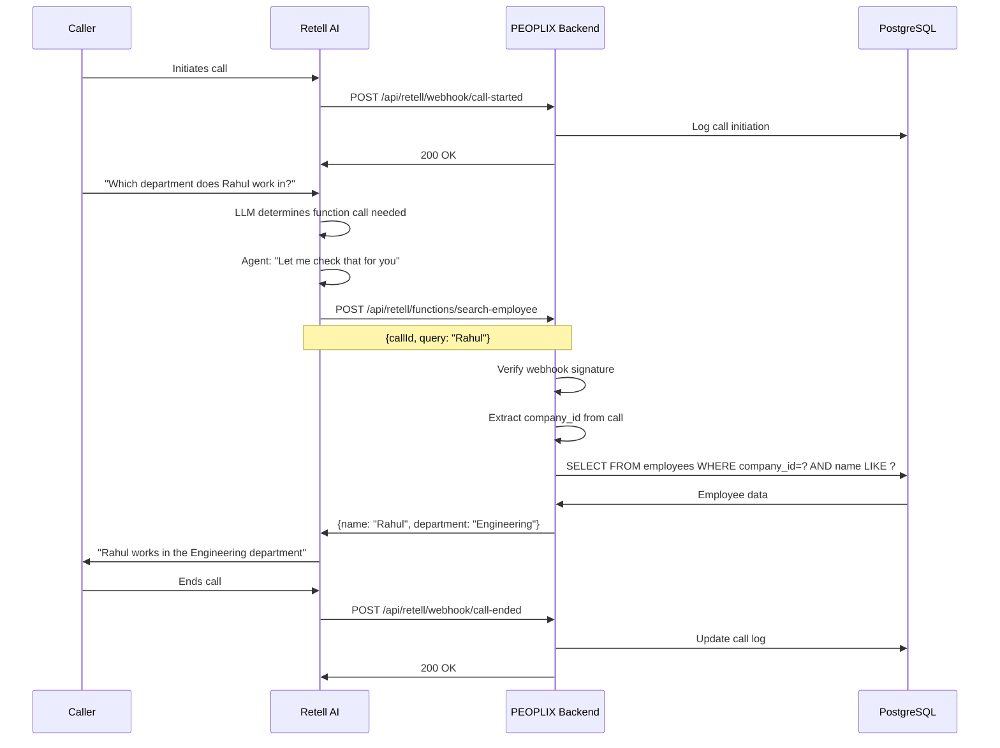

# PEOPLIX Retell AI Integration

## Overview

PEOPLIX integrates with Retell AI to provide multi-tenant voice agent capabilities. Each company gets AI agents that can query their specific authorized data through secure backend endpoints.

## Integration Architecture



## Retell Function Definitions

### 1. Search Employee

Query employee information by name, ID, or other attributes.

```typescript
// Function Definition (registered in Retell)
{
  name: "search_employee",
  description: "Search for employee information by name, employee number, or email",
  parameters: {
    type: "object",
    properties: {
      query: {
        type: "string",
        description: "Employee name, number, or email to search for"
      }
    },
    required: ["query"]
  }
}

// Backend Endpoint
POST /api/retell/functions/search-employee
Headers:
  X-Retell-Signature: <webhook signature>
Body:
  {
    "call_id": "call_abc123",
    "query": "Rahul"
  }

Response:
  {
    "success": true,
    "data": {
      "employee_number": "EMP001",
      "first_name": "Rahul",
      "last_name": "Kumar",
      "department": "Engineering",
      "designation": "Senior Developer",
      "email": "rahul.kumar@company.com",
      "phone": "+1234567890"
    }
  }
```

### 2. Search FAQ

Query company FAQs.

```typescript
// Function Definition
{
  name: "search_faq",
  description: "Search company FAQs and knowledge base",
  parameters: {
    type: "object",
    properties: {
      query: {
        type: "string",
        description: "Question or topic to search for"
      }
    },
    required: ["query"]
  }
}

// Backend Endpoint
POST /api/retell/functions/search-faq
Body:
  {
    "call_id": "call_abc123",
    "query": "vacation policy"
  }

Response:
  {
    "success": true,
    "data": {
      "question": "What is the vacation policy?",
      "answer": "Employees receive 15 days of paid vacation per year...",
      "category": "HR Policies"
    }
  }
```

### 3. Search Policy

Query company policies.

```typescript
// Function Definition
{
  name: "search_policy",
  description: "Search company policies and procedures",
  parameters: {
    type: "object",
    properties: {
      query: {
        type: "string",
        description: "Policy name or topic"
      }
    },
    required: ["query"]
  }
}

// Backend Endpoint
POST /api/retell/functions/search-policy
Body:
  {
    "call_id": "call_abc123",
    "query": "remote work"
  }

Response:
  {
    "success": true,
    "data": {
      "title": "Remote Work Policy",
      "content": "Employees may work remotely up to 3 days per week...",
      "effective_date": "2025-01-01"
    }
  }
```

### 4. Get Department Info

Get department details.

```typescript
// Function Definition
{
  name: "get_department",
  description: "Get information about a specific department",
  parameters: {
    type: "object",
    properties: {
      department_name: {
        type: "string",
        description: "Name of the department"
      }
    },
    required: ["department_name"]
  }
}

// Backend Endpoint
POST /api/retell/functions/get-department
Body:
  {
    "call_id": "call_abc123",
    "department_name": "Engineering"
  }

Response:
  {
    "success": true,
    "data": {
      "name": "Engineering",
      "description": "Software development and technology",
      "manager": "John Doe",
      "employee_count": 45
    }
  }
```

## Webhooks

### Call Started

```typescript
POST /api/retell/webhook/call-started
Headers:
  X-Retell-Signature: <signature>
Body:
  {
    "call_id": "call_abc123",
    "agent_id": "agent_xyz",
    "from_number": "+1234567890",
    "to_number": "+0987654321",
    "started_at": "2026-09-01T10:00:00Z"
  }

Response: 200 OK
```

### Call Ended

```typescript
POST /api/retell/webhook/call-ended
Headers:
  X-Retell-Signature: <signature>
Body:
  {
    "call_id": "call_abc123",
    "ended_at": "2026-09-01T10:05:30Z",
    "duration_seconds": 330,
    "transcript": "...",
    "summary": "..."
  }

Response: 200 OK
```

## Tenant Resolution

### How We Determine company_id from Retell Call

```typescript
// Option 1: Phone Number Mapping
// When call comes in, lookup company by phone number
const agent = await retellAgentRepo.findByRetellAgentId(agentId);
const companyId = agent.company_id;

// Option 2: Call Metadata
// Store company_id when creating web call
const webCall = await retellClient.createWebCall({
  agent_id: retellAgentId,
  metadata: {
    company_id: companyId
  }
});

// Later extract from webhook
const { company_id } = call.metadata;

// Option 3: Agent Mapping
// Map Retell agent_id to company
const agentMapping = await db.query(
  'SELECT company_id FROM retell_agents WHERE retell_agent_id = $1',
  [agentId]
);
```

**CRITICAL**: Never trust `company_id` from:
- Query parameters
- Request body (except webhook payload)
- Frontend requests
- LLM-generated data

Always resolve from:
- Retell agent mapping
- Call metadata (from our backend)
- Phone number lookup
- Authenticated session

## Security

### Webhook Signature Verification

```typescript
import crypto from 'crypto';

function verifyRetellSignature(
  payload: string,
  signature: string,
  secret: string
): boolean {
  const expectedSignature = crypto
    .createHmac('sha256', secret)
    .update(payload)
    .digest('hex');
    
  return crypto.timingSafeEqual(
    Buffer.from(signature),
    Buffer.from(expectedSignature)
  );
}

// Middleware
export async function verifyRetellWebhook(
  request: FastifyRequest,
  reply: FastifyReply
) {
  const signature = request.headers['x-retell-signature'] as string;
  const payload = JSON.stringify(request.body);
  
  if (!verifyRetellSignature(payload, signature, process.env.RETELL_WEBHOOK_SECRET!)) {
    return reply.status(401).send({ error: 'Invalid signature' });
  }
}
```

### Rate Limiting

```typescript
// Per company rate limits (handled by @fastify/rate-limit plugin)
const rateLimits = {
  search_employee: { max: 100, window: '1m' },
  search_faq: { max: 200, window: '1m' },
  search_policy: { max: 50, window: '1m' }
};

// Rate limiting is now automatically handled by Fastify
// No need for manual Redis-based rate limiting
```

## Response Format

### Success Response

```json
{
  "success": true,
  "data": {
    // Actual data
  }
}
```

### Not Found Response

```json
{
  "success": false,
  "error": {
    "code": "NOT_FOUND",
    "message": "I couldn't find that information in the company's records."
  }
}
```

**Important**: Return user-friendly messages that the AI can speak naturally.

### Error Response

```json
{
  "success": false,
  "error": {
    "code": "INTERNAL_ERROR",
    "message": "I'm having trouble accessing that information right now. Please try again."
  }
}
```

## Natural Language Responses

The backend should return structured data that the LLM can convert to natural speech:

### Good Response (Structured)

```json
{
  "success": true,
  "data": {
    "employee_number": "EMP001",
    "first_name": "Rahul",
    "last_name": "Kumar",
    "department": "Engineering",
    "designation": "Senior Developer"
  }
}
```

Agent will say:
> "Rahul Kumar works in the Engineering department as a Senior Developer."

### Bad Response (Pre-formatted text)

```json
{
  "success": true,
  "data": {
    "message": "Employee EMP001, Rahul Kumar, is located in the Engineering department..."
  }
}
```

This limits the AI's ability to respond naturally.

## Caching Strategy

### Cache Frequent Queries

```typescript
import { cache } from '../infrastructure/cache/memory-cache.js';

// Cache employee lookups
const cacheKey = `company:${companyId}:employee:${employeeNumber}`;
let employee = await cache.get(cacheKey);

if (!employee) {
  employee = await employeeRepo.findByNumber(companyId, employeeNumber);
  await cache.set(cacheKey, employee, 300); // 5 min TTL
}

// Cache FAQ searches
const faqCacheKey = `company:${companyId}:faq:${hash(query)}`;
// ...similar pattern
```

### Cache Invalidation

```typescript
// When employee is updated
await cache.delete(`company:${companyId}:employee:${employeeNumber}`);

// When company data changes
await cache.deletePattern(`company:${companyId}:*`);
```

## Error Handling

### Graceful Degradation

```typescript
try {
  const employee = await employeeService.search(companyId, query);
  return { success: true, data: employee };
} catch (error) {
  logger.error('Employee search failed', { companyId, query, error });
  
  // Return user-friendly error
  return {
    success: false,
    error: {
      code: 'SEARCH_FAILED',
      message: "I'm having trouble searching for that employee right now."
    }
  };
}
```

### Never Expose Internal Details

❌ Bad:
```json
{
  "error": "PostgreSQL connection timeout at line 45 in employee.repository.ts"
}
```

✅ Good:
```json
{
  "error": {
    "code": "SERVICE_UNAVAILABLE",
    "message": "I'm having trouble accessing that information right now."
  }
}
```

## Testing

### Test Webhook Signature

```bash
curl -X POST http://localhost:3000/api/retell/webhook/call-started \
  -H "Content-Type: application/json" \
  -H "X-Retell-Signature: <generated-signature>" \
  -d '{"call_id":"test_123","agent_id":"agent_xyz"}'
```

### Test Function Calls

```bash
curl -X POST http://localhost:3000/api/retell/functions/search-employee \
  -H "Content-Type: application/json" \
  -H "X-Retell-Signature: <generated-signature>" \
  -d '{"call_id":"call_123","query":"Rahul"}'
```

## Monitoring

### Metrics to Track

- Function call latency (p50, p95, p99)
- Function call success rate
- Cache hit rate
- Retell API latency
- Tenant-specific usage

### Alerts

- Function latency > 500ms
- Error rate > 1%
- Retell webhook failures
- Cache failures

---

**Last Updated**: September 2026
**Version**: 1.0
