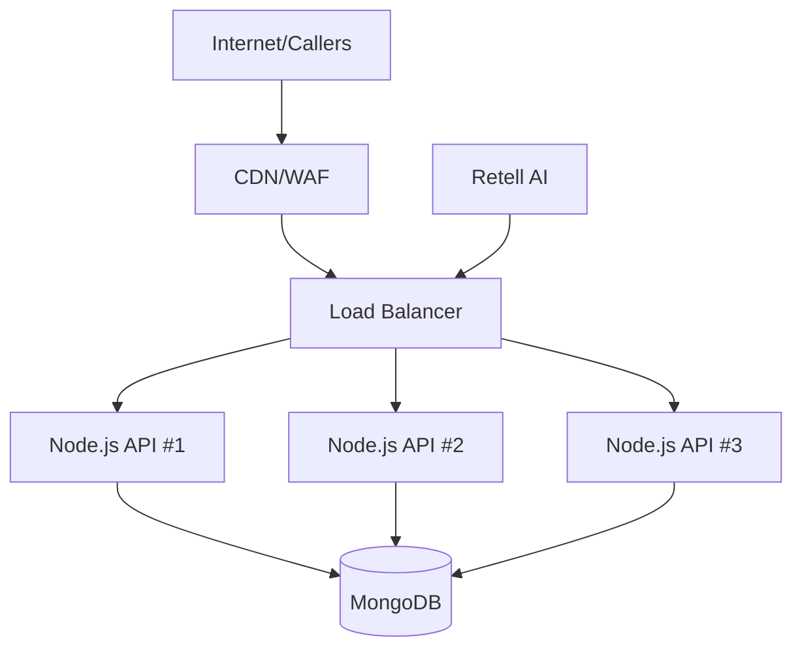
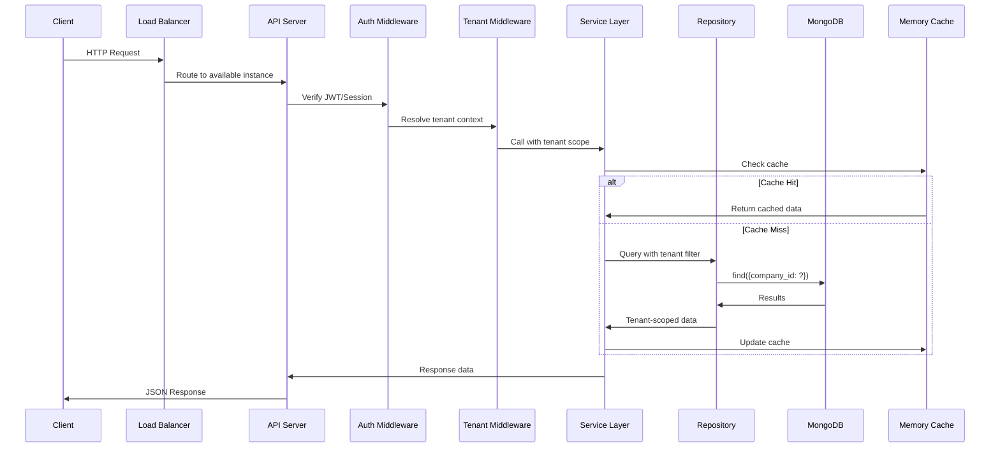
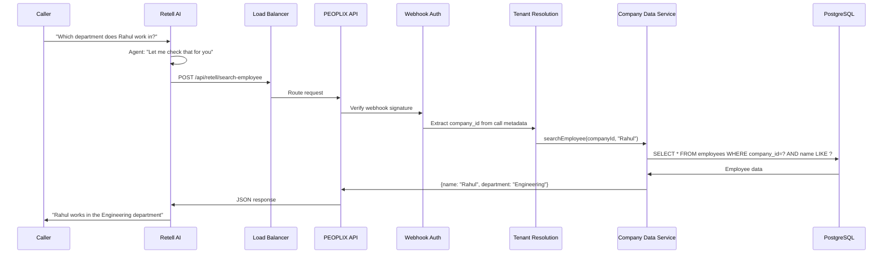

# PEOPLIX System Architecture

## Overview

PEOPLIX is a production-ready, multi-tenant SaaS platform providing AI voice agents to multiple companies. The architecture is designed for horizontal scalability, security, and high performance.

## Architecture Principles

1. **Multi-tenant by default** - Every query is tenant-scoped
2. **Stateless backend** - Can scale horizontally behind a load balancer
3. **Security-first** - Zero trust for tenant isolation
4. **Performance-optimized** - Low latency, high throughput
5. **Modular monolith** - Clean separation, can split into microservices later

## High-Level Architecture



## Technology Stack

### Core
- **Runtime**: Node.js 20+
- **Language**: TypeScript
- **HTTP Framework**: Fastify (high performance, low overhead)
- **Database**: MongoDB Atlas
- **AI Integration**: Retell AI

### Key Libraries
- **fastify** - HTTP server
- **@fastify/cors** - CORS handling
- **@fastify/helmet** - Security headers
- **@fastify/rate-limit** - Rate limiting
- **mongodb** - MongoDB driver
- **zod** - Schema validation
- **bcrypt** - Password hashing
- **jsonwebtoken** - JWT authentication
- **pino** - Structured logging

## Request Flow

### Standard API Request



### Retell AI Function Call Flow



## Tenant Isolation Strategy

### Core Principle
**NEVER trust company_id from client/frontend/LLM**

### Tenant Resolution Hierarchy

1. **Authentication**: JWT contains `user_id`
2. **User Lookup**: `users` table has `company_id`
3. **Tenant Context**: Middleware injects `tenantId` into request
4. **Service Layer**: All operations receive `tenantId` as first parameter
5. **Repository Layer**: All queries include `WHERE company_id = $1`

### Middleware Chain

```typescript
Request
  → authenticateJWT()          // Verify token, extract userId
  → resolveTenant()            // Query user's companyId
  → injectTenantContext()      // Add to request.tenant
  → Route Handler
  → Service (tenantId, ...)    // Tenant always first param
  → Repository WHERE company_id = tenantId
```

### Example Code Pattern

```typescript
// ❌ WRONG - Trusts client
router.post('/employees', async (req) => {
  const { company_id, name } = req.body;
  return db.query('SELECT * FROM employees WHERE company_id = $1', [company_id]);
});

// ✅ CORRECT - Uses authenticated tenant
router.post('/employees', 
  authenticateJWT,
  resolveTenant,
  async (req) => {
    const tenantId = req.tenant.id; // From auth, not from body
    const { name } = req.body;
    return employeeService.search(tenantId, name);
  }
);
```

## Horizontal Scaling

### Stateless Design

All Node.js instances are **completely stateless**:
- No in-memory session storage
- No instance-specific state
- No sticky sessions required
- Any request can go to any instance

### Session/State Management

- **JWT**: Stateless, no server storage
- **Caching**: In-memory cache with TTL support
- **Rate Limiting**: Fastify built-in rate limiting

### Health Checks

```
GET /health          - Basic health (200 OK)
GET /health/ready    - Deep health check
  └─ MongoDB connection
```

### Graceful Shutdown

```typescript
process.on('SIGTERM', async () => {
  // 1. Stop accepting new requests
  // 2. Wait for active requests to complete (30s timeout)
  // 3. Close database connections
  // 4. Exit
});
```

## Security Architecture

### Authentication & Authorization

1. **Admin Users**: JWT-based, stored in PostgreSQL
2. **Company Users**: JWT-based, tenant-scoped
3. **Retell Webhooks**: Signature verification
4. **API Keys**: For programmatic access (future)

### Security Layers

```
┌─────────────────────────────────────┐
│ WAF / Rate Limiting                 │
├─────────────────────────────────────┤
│ HTTPS / TLS                         │
├─────────────────────────────────────┤
│ CORS / Security Headers             │
├─────────────────────────────────────┤
│ Input Validation (Zod)              │
├─────────────────────────────────────┤
│ Authentication (JWT)                │
├─────────────────────────────────────┤
│ Tenant Isolation (Middleware)       │
├─────────────────────────────────────┤
│ Authorization (RBAC)                │
├─────────────────────────────────────┤
│ SQL Injection Protection (Params)   │
├─────────────────────────────────────┤
│ Audit Logging                       │
└─────────────────────────────────────┘
```

### Secrets Management

**NEVER in code**:
- API keys
- Database passwords
- JWT secrets
- Encryption keys

**Always in**:
- Environment variables
- AWS Secrets Manager (production)
- `.env` (local development only, gitignored)

## Performance Optimizations

### Database

- **Connection pooling**: 20-50 connections per instance
- **Indexes**: All foreign keys, common query patterns
- **Pagination**: Cursor-based for large datasets
- **Prepared statements**: Prevent SQL injection + performance
- **Query optimization**: Analyze slow queries

### In-Memory Caching Strategy

```
Cache Structure:
  company:{id}:context       TTL: 1 hour
  company:{id}:employee:{id} TTL: 5 minutes
  company:{id}:faq:{id}      TTL: 10 minutes
```

**Cache Invalidation**:
- Update employee → Invalidate `company:{id}:employee:{employeeId}`
- Update company → Invalidate `company:{id}:*`

**Note**: The current in-memory cache is suitable for single-instance deployments. For distributed/production deployments with multiple instances, consider integrating Redis, Memcached, or a managed cache service like Upstash.

### Background Jobs

Move heavy operations to background:
- Document processing
- Transcript analysis
- Analytics computation
- Bulk imports
- Email sending

## Monitoring & Observability

### Structured Logging

```json
{
  "timestamp": "2026-09-01T10:15:30Z",
  "level": "info",
  "requestId": "req_abc123",
  "tenantId": "company_xyz",
  "endpoint": "POST /api/employees/search",
  "duration": 45,
  "status": 200
}
```

**Never log**:
- Passwords
- JWT tokens
- API keys
- Full documents
- PII without consent

### Metrics

- Request rate (per endpoint)
- Response time (p50, p95, p99)
- Error rate
- Database query time
- Cache hit rate
- Retell API latency
- Active connections
- Memory usage
- CPU usage

## Deployment Architecture

### Docker Containers

```
┌──────────────────────────────────────┐
│  Load Balancer                       │
│  (ALB, Nginx, etc.)                  │
└─────────────┬────────────────────────┘
              │
    ┌─────────┴─────────┬──────────────┐
    │                   │              │
┌───▼────┐         ┌────▼───┐     ┌───▼────┐
│ API #1 │         │ API #2 │     │ API #3 │
│ Node.js│         │ Node.js│     │ Node.js│
└───┬────┘         └────┬───┘     └───┬────┘
    │                   │              │
    └───────────────────┼──────────────┘
                        │
                   ┌────▼────┐
                   │ MongoDB  │
                   └──────────┘
```

### Environment Variables Per Container

```
NODE_ENV=production
DATABASE_URL=mongodb://...
RETELL_API_KEY=...
JWT_SECRET=...
LOG_LEVEL=info
PORT=3000
```

## Scalability Targets

### Current Architecture Supports

- **Companies**: 10,000+
- **Users**: 100,000+
- **Employees**: 1,000,000+
- **Concurrent API requests**: 10,000+
- **Concurrent voice calls**: 1,000+
- **Database size**: 1TB+

### Horizontal Scaling

Adding more capacity:
```
1 instance  →  10 requests/sec
10 instances → 100 requests/sec
100 instances → 1,000 requests/sec
```

## Future Considerations

### When to Split into Microservices

Consider splitting when:
1. Team size > 20 engineers
2. Different scaling needs (e.g., call processing vs admin)
3. Independent deployment requirements
4. Different technology requirements

### Potential Services

```
API Gateway
├─ Auth Service
├─ Company Management Service
├─ Employee Data Service
├─ Document Service
├─ Call/Voice Service (Retell Integration)
├─ Analytics Service
└─ Notification Service
```

### Current Approach

**Modular Monolith** with clear module boundaries:
- Easy to develop and debug
- Simple deployment
- Low operational overhead
- Can extract services later without rewriting everything

---

**Last Updated**: September 2026
**Version**: 1.0
